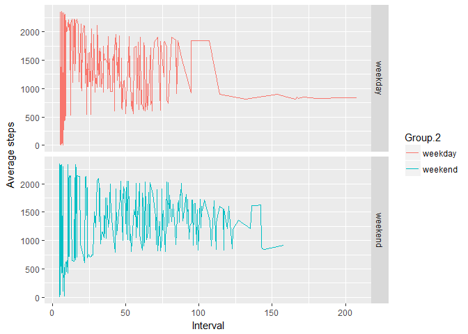

# Reproducible Research: Peer Assessment 1


## Loading and preprocessing the data

```r
df <- read.csv(unz("activity.zip","activity.csv"),header = TRUE, sep=",")
df$date <- as.Date(df$date,"%Y-%m-%d")

summary(df)
```

```
##      steps             date               interval     
##  Min.   :  0.00   Min.   :2012-10-01   Min.   :   0.0  
##  1st Qu.:  0.00   1st Qu.:2012-10-16   1st Qu.: 588.8  
##  Median :  0.00   Median :2012-10-31   Median :1177.5  
##  Mean   : 37.38   Mean   :2012-10-31   Mean   :1177.5  
##  3rd Qu.: 12.00   3rd Qu.:2012-11-15   3rd Qu.:1766.2  
##  Max.   :806.00   Max.   :2012-11-30   Max.   :2355.0  
##  NA's   :2304
```


## What is mean total number of steps taken per day?
Removing the na values and making a histogram of the steps per day. 


```r
stepsperday <- df[!is.na(df$steps),]
stepsperday <- aggregate(. ~ date,stepsperday,sum)[,1:2]

hist(stepsperday$steps)
```

<!-- -->


Mean and median of the total number of steps taken per day

```r
boxplot(stepsperday$steps,ylab="Number of steps per day")
```

<!-- -->


## What is the average daily activity pattern?

```r
stepsperinterval <- aggregate(. ~ interval,df,mean)[,1:2]
plot(stepsperinterval$interval,stepsperinterval$steps, type="l", xlab="interval",
     ylab="average number of steps")
```

<!-- -->

```r
maxintervalvalue <- max(stepsperinterval$steps)
maxinterval <-  stepsperinterval[stepsperinterval$steps == maxintervalvalue,1]
```
The 5-minute interval, on average across all the days in the dataset, containing
the maximum number of steps is 835 (206.1698113)


## Imputing missing values


```r
numberofmissingvalues <-  sum(is.na(df$steps))
```

There are 2304 rows in the dataset containing NAs. I will
replace these values by the mean of the dataset. Then I plot the histogram and the means and medians.


```r
 df2 <- transform(df, steps = ifelse(is.na(steps), mean(steps, na.rm=TRUE), steps))

stepsperday2 <- aggregate(. ~ date,df2,sum)[,1:2]

hist(stepsperday2$steps)
```

<!-- -->

```r
boxplot(stepsperday$steps,ylab="Number of steps per day (no NAs)")
```

<!-- -->


We can see that these values do not differ a lot from the estimates from the first part of the assignment.
The total number of steps was 570608 but is now 656737


## Are there differences in activity patterns between weekdays and weekends?


```r
df2$weekday <- factor(ifelse(weekdays(df2$date) %in% c("samedi","dimanche"), "weekend","weekday"))
stepsperdaytype <- aggregate(x= df2$steps,by=list(df2$interval,df2$weekday), FUN="mean")

library(ggplot2)
ggplot(stepsperdaytype,aes(x=x,y=Group.1,color=Group.2)) + geom_line() + xlab("Interval") + ylab("Average steps") + facet_grid(stepsperdaytype$Group.2 ~ .)
```

<!-- -->


